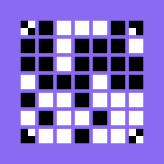
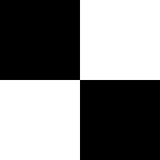
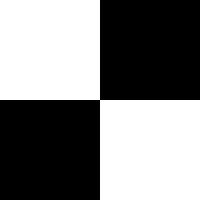
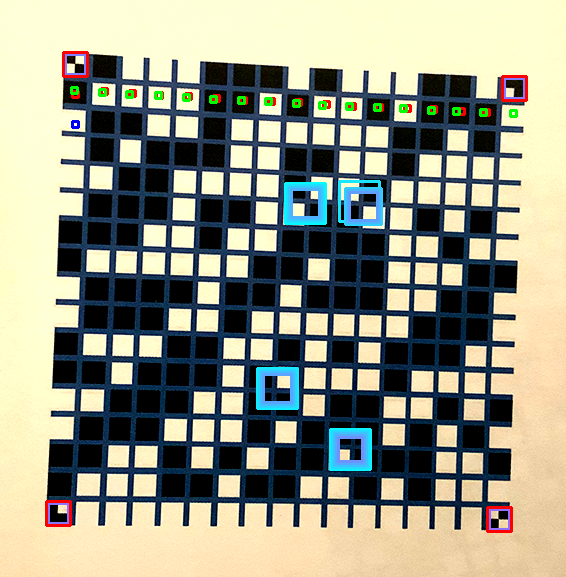
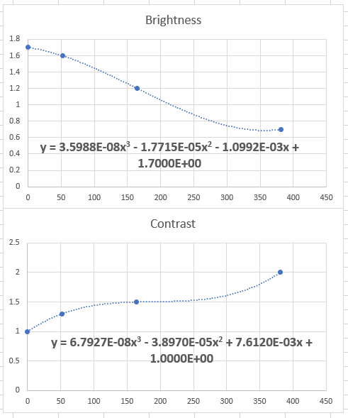
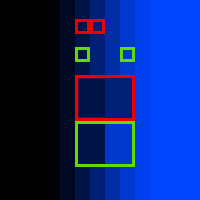

# Some Documentation [Incomplete]

Written by Andre Pham. This was never complete because it was too much effort, however it provides some pretty decent insight into much of the core functionality.

[TOC]

## Terminology

#### VISREP

A VISREP (visual representation) is what the program produces and reads; an image of white and black blocks.

 *A VISREP.*

#### Identity Blocks

The corner blocks of a VISREP to help the program identify where the VISREP starts and ends, as well as other dimensional variables of it. There are four unique designs.

 *Identity block 1 (top left).*

 *Identity block 2 (top right).*

 *Identity block 3 (bottom left).*

 *Identity block 4 (bottom right)*

## read_visrep_photo.py

#### Function check_square_shape

```python
def check_square_shape(len_top, len_bottom, len_left, len_right):
    '''
    Determins whether a four sided polygon is a square by comparing the lengths
    of the top and the bottom sides, and the left and the right sides.

    PARAMETERS:
        len_top = length of the top side, in pixels
        len_bottom = length of the bottom side, in pixels
        len_left = length of the left side, in pixels
        len_right = length of the right side, in pixels
    OUTPUT:
        If the polygon is considered a square, returns True. Otherwise, returns
        False.
    '''
    # Calculate proximity_threshold, which is an abstract value which is the
    # minimum value that the top/bottom and left/right lengths can be
    # different by for the polygon to still be considered a square.
    proximity_threshold = min([len_top, len_bottom, len_left, len_right])/5

    # If the top length and bottom length difference, or the left and right
    # length difference is greater than the proximity threshold
    if (abs(len_top - len_bottom) > proximity_threshold or
        abs(len_left - len_right) > proximity_threshold):
        # The polygon is not a square
        return False
    # Otherwise, the polygon is a square
    return True
```

This function was made because sometimes the program was identifying blocks (or other abstractions) as the identity block patters, which would cause the program to later incorrectly identify the rest of the VISREP.

 
*An example of the program identifying other non-identity blocks as identity blocks (blue), before finally finding the correct location of the identity blocks (red). This screenshot was before when the reference images for the identity blocks were cropped, rather than expanded.*

Hence as a method of validation, the program only confirms the location of the identity blocks when the positions of them loosely represent a square shape, hence the function.

*Note: the reason the program was changed from cropping the identity block reference images to expanding them was because sometimes a VISREP would generate the blocks that represented the shapes of the identity blocks, in a square formation, hence bypassing the validation. Because identity blocks are smaller than four regular blocks forming an identity block, expanding a tiny reference image proved to avoid this conflict. It also provided other benefits such as faster scanning times and easier implementation of exponential expansion of the reference identity blocks.

#### Function expand_image

```python
def expand_image(cv2_image):
    '''
    Expands a square image. Expands all sides evenly. Intended for identity
    block reference images.
    The reason for expanding is that if the identity block reference images are
    too small or too large for the visrep image being scanned, the identity
    blocks won't be able to be found.

    PARAMETERS:
        cv2_image = image file ran through cv2.imread()
    OUTPUT:
        The provided cv2_image, expanded.
    '''
    # Determine the length (width and height = length because image is square)
    length, _, _ = cv2_image.shape
    # Determine the new length
    if length >= ID_RESIZE_COMPOUND_THRESHOLD:
        new_length = int(length*ID_RESIZE_COMPOUND)
        # Make new_length an even number so there's equal black/white pixels
        new_length -= new_length%2
    else:
        new_length = length + ID_RESIZE_INCREMENT
    # Expand the image
    cv2_image = cv2.resize(
        cv2_image,
        (new_length, new_length),
        interpolation = cv2.INTER_NEAREST
    )
    # Return the expanded image
    return cv2_image
```

This function expands the reference images for the identity blocks so they can be matched onto the image being scanned (read). cv2's image-matching process requires the image being referenced (the 'reference') and that same reference on the image being searched that contains the reference, to be somewhat similar in size (pixel size) to it on the image being searched. Basically, for the identity blocks to be found on the VISREP image being read, identity block images being used as references must be similar in size (pixel size) to how the identity blocks appear on the VISREP image.

Because the size of the identity blocks (and hence also the size of the identity block reference images) cannot be known prior to scanning the VISREP, the reference images for the identity blocks must iterate over many different sizes until they are the correct size to be matched. Hence this this function's purpose; to resize (enlarge) the identity block reference images, so that the program can re-search for a match on the VISREP image.

The reference images' sizes begin incrementing in length linearly, increasing every iteration by ID_RESIZE_INCREMENT pixels. This is to avoid increasing past the size of the identity blocks, and missing them. After the length becomes larger than ID_RESIZE_COMPOUND_THRESHOLD, the size begins increasing exponentially (compound gain through iterated multiplication). This is because larger ID blocks have more room for error (doesn't matter if it's exact), and speeding up the growth rate greatly increases speed of finding the identity blocks, by skipping unnecessary iterations.

Make note of the interpolation method (cv2.INTER_NEAREST), which ensures the original identity block reference images don't lose quality upon expansion.

#### Adjusting brightness and contrast

```python
# Identify the brightness adjustment
# 1. Identify four known black pixels (next to each other)
black_color_ref_list = [
    sum(list(cv2_visrep[start_y-1][start_x-1])),
    sum(list(cv2_visrep[start_y-1][start_x])),
    sum(list(cv2_visrep[start_y][start_x])),
    sum(list(cv2_visrep[start_y][start_x-1]))
]
# 2. Average the BGR colour value to estimate the average black pixel colour
black_color_ref = sum(black_color_ref_list)/4
# 3. Determine the amount of brightness adjustment needed relative to how
# bright the estimated average black pixel is
# (based on fitted cubic graph using points [0, 1.7], [52, 1.6],
# [164.5, 1.2], [381, 0.7] which were collected from testing images)
brightness_enhance = (
    3.5988E-8*black_color_ref**3 -
    1.7715E-5*black_color_ref**2 -
    1.0992E-3*black_color_ref +
    1.7000
)
# Enhance the brightness
enhancer = ImageEnhance.Brightness(PIL_visrep)
PIL_visrep_enhance = enhancer.enhance(brightness_enhance)
# Identify contrast adjustment
# (based on fitted cubic graph using points [0, 1], [52, 1.3], [164.5, 1.5],
# [381, 2] which were collected from testing images)
contrast_enhance = (
    6.7927E-08*black_color_ref**3 -
    3.8970E-05*black_color_ref**2 +
    7.6120E-03*black_color_ref +
    1.0000
)
# Enhance the contrast
enhancer = ImageEnhance.Contrast(PIL_visrep_enhance)
PIL_visrep_enhance = enhancer.enhance(contrast_enhance)
```

One issue that was resolved was having images misread because they were too bright or too dark, or not contrasted enough. Low-contrast images sometimes had difficulty in finding edges between blocks, as not enough of a colour or brightness change could be detected. Sometimes detecting whether a block was white or black proved difficult as the entire image being too dark or bright would cause the block to be read incorrectly. If only a single block is misread, or a single edge is not detected, the entire VISREP can be reported as wrong, hence the requirement for all images to be adjusted in contrast and brightness.

It was found however that images can't be all adjusted the same way. Increasing the contrast too much would cause too-bright or too-dark images to become even darker or brighter and harder to read, and hence make edge detection even more difficult (for example if a black block was placed next to a dark purple background, the dark purple would be darkened to increase contrast, however this would become indistinguishable to the black next to it). Other images would not be contrasted enough, and suffer the same problems as if it were not contrasted at all. While some images required a brightness increase, others required dimming for better colour balance. A bright image being brightened would prove fatal, while a dark image being darkened would also prove fatal. Doing nothing in both cases would also be fatal, hence the need for adaptive brightness adjustments.

The following functions were made to calculate the contrast and brightness needed.

 
*Vertical axis represents the amount of brightness or contrast, horizontal axis represents the level of brightness of the black pixels within the first identity block; 0 being 100% black, and 765 being 100% white. A brightness adjustment greater than 1 increases brightness, while a brightness adjustment smaller than 1 decreases brightness. A greater contrast adjustment increases contrast.*

Sample images were collected, and adjusted according to their level of brightness and contrast. The level of brightness and contrast needed for each image was paired with the level of brightness found in the black pixels within the first identity block, which is used as a reference to how bright the image was before adjustment. This allowed for the the calculation of how much brightness and contrast is required (approximately) for any type of image. This resolved the issue.

#### Resizing the VISREP image

```python
# Identify the height and width of the visrep
height, width, _ = cv2_visrep.shape
# Identify the longest side of the visrep
max_length = max([width, height])
# If the visrep is too large, resize the visrep
if max_length > MAX_LENGTH:
    scale = MAX_LENGTH/max_length
    new_width = int(width*scale)
    new_height = int(height*scale)
    cv2_visrep = cv2.resize(
        cv2_visrep,
        (new_width, new_height),
        interpolation=cv2.INTER_AREA
    )
```

This block of code has the purpose of decreasing the pixel size of the image file containing the VISREP being read. This greatly improves the speed and efficiency of the program:

- Greatly improves speed for finding the identity blocks, as there are less pixels to search, and there are less iterations of identity block reference image expansions required to be a viable size to be matched.
- Reduces number of pixels to be counted/read when reading  the number of similar pixels across/down for the adjustment of live_x and live_y.

#### Function check_color_change

```python
def check_color_change(x1, y1, x2, y2):
        '''
        Determines whether pixels at two different coordiantes are far enough in
        color (BGR sum difference of each pixel is greater or equal to
        BGR_THRESHOLD) to be considered different colours.

        PARAMETERS:
            x1 = x coordinate for first pixel to compare
            y1 = y coordinate for first pixel to compare
            x2 = x coordiante for second pixel to compare
            y2 = y coordinate for second pixel to compare
        OUTPUT:
            If the two pixels are considered different colours, returns True.
            Otherwise, returns False.
        '''
        nonlocal cv2_visrep_enhance

        # Define BGR colours of the two pixels being compared
        bgr1 = list(cv2_visrep_enhance[y1][x1])
        bgr2 = list(cv2_visrep_enhance[y2][x2])

        # If the pixels at (x1, y1) and (x2, y2) are not close in brightness
        if (abs(sum(bgr1) - sum(bgr2)) >= BGR_THRESHOLD and
                # If the image blacks are too bright, detecting by brightness
                # is not reliable because same-colour pixels will have great
                # contrast, hence the 'and black_color_ref' requirement
                black_color_ref < 300 or
                # Or the blue channels are far apart enough
                abs(int(bgr1[0]) - int(bgr2[0])) >= BGR_CHANNEL_THRESHOLD or
                # Or the green channels are far apart enough
                abs(int(bgr1[1]) - int(bgr2[1])) >= BGR_CHANNEL_THRESHOLD or
                # Or the red channels are far apart enough
                abs(int(bgr1[2]) - int(bgr2[2])) >= BGR_CHANNEL_THRESHOLD):
            # Return True
            return True
        # If the pixels are close enough in brightness, return False
        return False
```

This function was required to be implemented to identify the size of the blocks and gaps between the blocks, as well as adjusting to the centre of blocks when reading a VISREP, by reading how many same-colour pixels are down/across from a position.

Originally, all that was required for the pixels to be considered different colours was for the absolute difference of the sum of the BRG values of each pixel to be relatively high, hence indicating a different colour due to different BGR values. However, this proved to be unsatisfactory for images that were either too bright, or not greatly enough contrasted. This is because images that were either too bright or had low contrast experienced the greatest amount of contrast/darkening adjustment by the program, in order to identify edges of blocks within the VISREP. The side effect of this was that pixels within blocks would experience a great amount of noise, hence some pixels within blocks would satisfy being considered as different colours from each other, causing mis-readings of VISREPs. To counteract this, for two pixels to be considered different colours via the previous method, the image would have to have a certain level of darkness to verify that there wouldn't be too much noise. New conditions were also created for identifying a colour difference, that is identifying a large enough difference in any one of the BGR channels would indicate a different colour. Using this method, a light-black pixel and a dark-black pixel would be identified as the same colour (due to having lesser differences in each colour channel), however a black and a blue pixel would be differentiated (due to having a greater difference in a single colour channel). This also improved the accuracy of previous images, as it added another level of colour difference detection for more reliable results.

#### Function find_largest_contrast

```python
def find_largest_contrast(coord1, coord2, coord3, coord4):
        '''
        Determines which two adjacent pixels have the greatest contrast, out of
        four given coordinates.

        PARAMETERS:
            coord1 = (x, y) coordinates in list form
            coord2 = (x, y) coordinates in list form, between coord1 and coord3
            coord3 = (x, y) coordinates in list form, between coord2, and coord4
            coord4 = (x, y) coordinates in list form, after coord3
        OUTPUT:
            x = the x coordinate of the highest contrast pixel, relative to its
                adjacent pixel (of the two pixels with the highest contrast, x
                favoures the one on the right)
            y = the y coordinate of the highest contrast pixel, relative to its
                adjacent pixel (of the two pixels with the highest contrast, y
                favours the one on the bottom)
            pixel_count_add_x = how many pixels difference between the given x
                coordinate and the pixel with the highest contrast (of the two
                pixels with the highest contrast, favours the one on the left)
            pixel_count_add_y = how many pixels difference between the given y
                coordiante and the pixel with the highest contrast (of the two
                pixels with the highest contrast, favours the one on the top)
        '''
        nonlocal cv2_visrep_enhance

        # Define the colour values of each coordinate
        coord1_color = sum(list(cv2_visrep_enhance[coord1[1]][coord1[0]]))
        coord2_color = sum(list(cv2_visrep_enhance[coord2[1]][coord2[0]]))
        coord3_color = sum(list(cv2_visrep_enhance[coord3[1]][coord3[0]]))
        coord4_color = sum(list(cv2_visrep_enhance[coord4[1]][coord4[0]]))

        # Define a list of all the contrasts between the adjacent pixels
        contrasts = [
            abs(coord1_color - coord2_color),
            abs(coord2_color - coord3_color),
            abs(coord3_color - coord4_color)
        ]

        # Identify the index of the two pixels with the highest contrast
        max_contrast_pos = contrasts.index(max(contrasts))

        # Identify the coordinate with the highest contrast (favoured right)
        x, y = [coord2, coord3, coord4][max_contrast_pos]

        # Identify the distance between the original coordaintes and the highest
        # contrast coordinate (favoured left, hence the '- 1')
        pixel_count_add_x = x - coord1[0] - 1
        pixel_count_add_y = y - coord1[1] - 1

        return x, y, pixel_count_add_x, pixel_count_add_y
```

This function came to existence due to how edge detection was implemented into this program.

Originally, the program would go pixel by pixel until two adjacent pixels detected a colour difference. This would then be detected as an edge. This became an issue when images being tested had soft/fuzzy edges for the blocks. What would end up happening is that to the human eye, there would be a visible edge, however on a pixel-by-pixel basis, each pixel next to each other would be close enough in colour to be registered as not different enough to be considered a different colour by the program, and hence no edge would ever be detected. For example the program could clearly transition from black to blue, however if the colour transitioned slowly enough, no two pixels would be considered as an actual colour change, hence no edge detected.

 
*A transition from black to blue, however due to no clear edge existing, the program would move pixel by pixel without noticing a colour change.*

To solve this issue, the program was changed to compare two pixels that were two pixels apart (so two pixels between the two pixels being compared). This meant that soft colour transitions were not an issue anymore, as the soft transition was essentially 'jumped over', and there would be a large enough difference in colour to detect an edge.

 
*Comparison of the previous and current method of detecting edges. Red is the old, green is the new. The contrast difference between the green selected pixels is clearly much greater.*

However to then truly detect the edge, the program would have to decide which of the four pixels (two being read and the two in between) had the greatest contrast to be deemed the actual edge. This is the purpose of the function find_largest_contrast. Hence the code to detect edges:

```python
while not check_color_change(live_x, live_y, live_x+3, live_y):
    live_x += 1
live_x, live_y, _, _ = find_largest_contrast(
    [live_x, live_y],
    [live_x+1, live_y],
    [live_x+2, live_y],
    [live_x+3, live_y]
)
```

In this case, live_x is the position of the edge.

#### Adjusting to the centre of blocks.

```python
# Calculate the amount of adjustment needed for live_x to be in
# the horizontal centre of the block it's in
temp_x = live_x
pixel_count = 0
visrep_edge = False
# 1. Detect how many pixels of similar-enough colour there is to
# the right
while not check_color_change(temp_x, live_y, temp_x+3, live_y):
    temp_x += 1
    pixel_count += 1
    # If there are more similarly-coloured pixels to the right
    # than the size of an entire chunk, either something's
    # wrong, or we've reached the end of the visrep
    # (and black/white just continues)
    if pixel_count > block_len:
        visrep_edge = True
        break
_, _, pixel_count_add_x, _ = find_largest_contrast(
    [temp_x, live_y],
    [temp_x+1, live_y],
    [temp_x+2, live_y],
    [temp_x+3, live_y]
)
pixel_count += pixel_count_add_x
# 2. Calculate the amount of adjustment needed, which is the
# difference between the pixels counted, and the expected amount
# of pixels
adjust_x = int(pixel_count - block_len/2)
# 3. If the edge was detected, no adjustment is needed
if visrep_edge == True:
    adjust_x = 0
```

This program (the pixel reading parts, at least) is largely based on the concept of 'live_x' and 'live_y'. In concept live_x and live_y represent x and y coordinates on the canvas that are currently being used/read. So for example, live_x and live_y are located on a block. The block colour is read, so then the values of live_x and live_y are adjusted to be on the next block, which is then read, and so on.

An issue that came up is that even when the size of the blocks and position of the initially found blocks were very accurate, minor errors in the position of live_x and live_y would compound, causing the failure of reading VISREPs at first.

 
*Despite the size of the blocks being well known, and the first block's position (top left underneath first identity block) being well known, and the predicted spacing between each block being quite accurate, compounding errors caused the VISREP to be misread.*

To work around this issue, after each block was read, the program would read how many same-coloured pixels were to the right and above the live_x and live_y coordinates. It would then adjust to the centre of that block, based on the program's estimate of how large each block is (using the initial identity block) and how close the coordinates were to the right and top edges of the block. This resolved the issue.

## read_visrep_video.py

#### Threading.

The implementation of threading was to solve the issue of providing a video preview, and reading frames from a video feed at the same time.

There is the code for scanning the video's frames for VISREPs:

```python
def read_video():
    '''
    Scans the video feed from the device's webcam for visreps, and if one is
    detected, reads it.
    '''
    nonlocal output_visrep_matrix

    # Define video feed from camera
    video = cv2.VideoCapture(0)
    # Define list of successfully read visreps
    read_frames = []

    # Loop to constantly read camera frames (will run on a daemon thread,
    # meaning that it will automatically close when the main thread show_video
    # ends)
    while True:
        # Close if use has clicked ESC; hence stop reading
        if end_all_threads:
            break

        # Capture frame by frame
        running_status, frame = video.read()

        # Try scanning a visrep
        try:
            # Define the visrep matrix read from the current frame
            visrep_matrix = read_visrep_photo(frame)
            # Ensure it's a valid visrep by checking if every row in the visrep
            # matrix is the same length as the matrix; equal columns and rows
            if len(visrep_matrix) < 3:
                raise Exception("Invalid visrep reading")
            for row in visrep_matrix:
                if len(row) != len(visrep_matrix):
                    raise Exception("Invalid visrep reading")
            # Validate reading by making sure the same visrep has been scanned
            # twice (to ensure the visrep was read properly)
            if visrep_matrix in read_frames:
                # Return visrep
                output_visrep_matrix = visrep_matrix
                break
            # If this is the first instance of a given visrep
            else:
                # Add it to the read_frames list to validate a second reading
                read_frames.append(visrep_matrix)
        except:
            # No visrep was found in the frame
            pass
```

And there is also the code for showing the user a preview of their camera's video stream output.

```python
# Loop to constantly show camera view to user, until they press ESC
while cv2.waitKey(1) != 27 and video_thread.is_alive():
    # Capture frame by frame
    running_status, frame = video.read()

    # Flip frame to display
    frame = cv2.flip(frame, 1)

    # Display video to user
    cv2.imshow("Your Camera (Scan VISREP or ESC to Close)", frame)
```

The issue was that both while loops must be run simultaneously and end simultaneously (thus providing a video feed, and scanning the current video feed being previewed live). Hence to successfully run both while loops simultaneously, threading was used so that the main thread (showing the video preview) could occur at the same time as the secondary thread (reading the video for VISREPs). The first thread was made daemon so that it would end at the same time as the main thread.

## gen_visrep_matrix.py

#### High level algorithm for converting text to a VISREP matrix.

1. Convert the text's characters to ASCII decimal value.
2. Convert the ASCII decimal values to binary. Then add an extra 1 or 0, depending on if the letter is capitalised or not. (In retrospect, the extra 1 or 0 is not necessary, because capitalised letters already exist in ASCII. It would be easy to implement this change into the program, however I can't be bothered re-taking all the example pictures and such. It is not a huge issue, just a minor flaw.)
3. Calculate the length of the longest binary-represented character, then make every binary-representation the same length by adding 0s to the front.
4. Put the VISREP together, where each corner is an identity block, the first four blocks (excluding the first identity block) in binary, is how many bits make up each character (equivalent to the length we calculated earlier), the following blocks are each character represented in binary, sequentially, and finally empty 0s are added to the end (excluding the identity block corners) to make the total number of elements within the VISREP matrix a square number.

Example:

